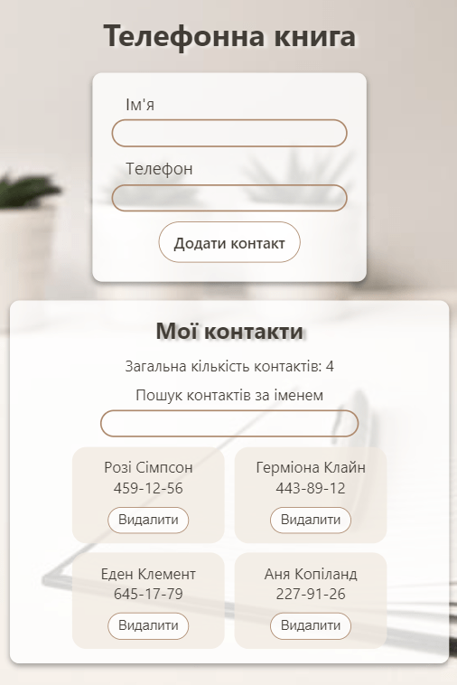

# Книга контактів

Виконано рефакторинг коду програми «Книга контактів». 

Видалено код, що відповідає за зберігання та читання контактів з локального сховища, та додано взаємодію з бекендом для зберігання контактів.

Бекенд

Створено свій персональний бекенд для розробки за допомогою UI-сервісу mockapi.io. 

P.S. Бібліотека redux-toolkit використовувались в цілях вивчення та засвоєння. 

Розуміння того, що на даному проєкті не потрібно використовувати ці бібліотеки є =)

