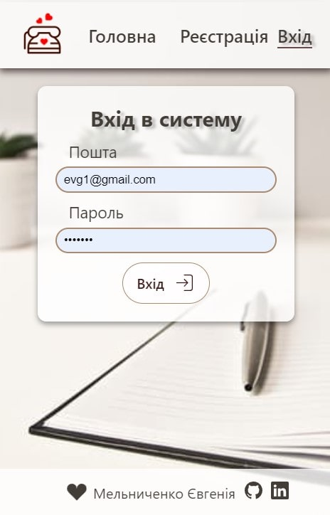
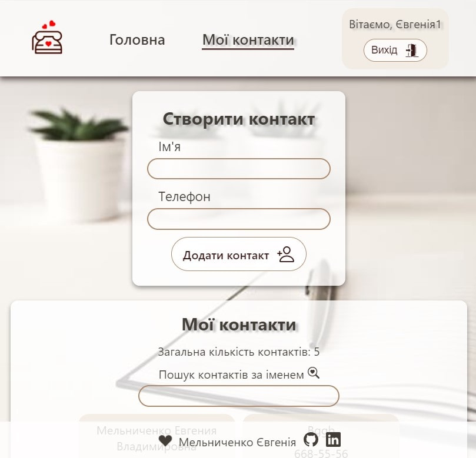

# Книга контактів

Додано можливість реєстрації, логіна та оновлення користувача, а також роботу з приватною колекцією контактів.

Для цього завдання використовувався готовий бекенд. 

Він підтримує всі необхідні операції з колекцією контактів, а також реєстрацію, логін та оновлення користувача за допомогою JWT.

